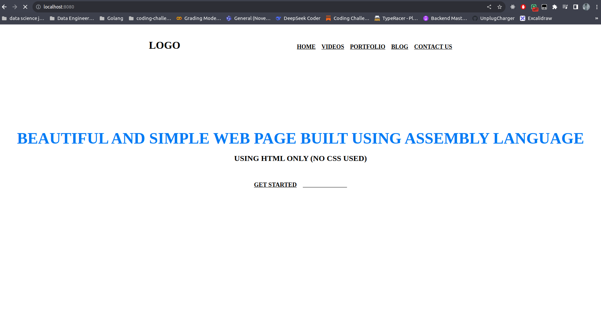

# asembly-website
This  was me in 1970

## How it works
### 1. Install dependencies
```we have no dependencies```

### 2. Run the app
```we have no app```

### 3. Test the app
```we have no tests```

### 4. Deploy the app
```we have no app to deploy```

### 5. Contribute
```we have no app to contribute to```

### 6. License
```we have no license```

### 7. Questions
```we have no questions```

### 8. Screenshots
```we have some screenshots```

